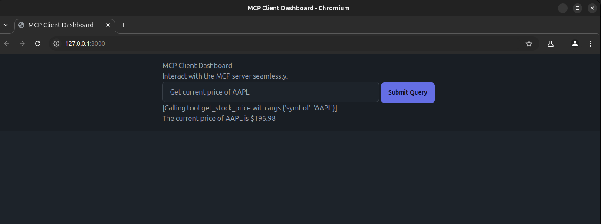

# MCP Yahoo Finance Server and UI



The **MCP Yahoo Finance Server** is a tool designed to fetch real-time stock data, company information, and historical price data using the Yahoo Finance API. It integrates with the Multi-Client Protocol (MCP) framework to provide seamless communication between clients and the server.
The project also includes a web-based UI built using FastAPI and DaisyUI components , enabling users to interact with the server through an intuitive interface

## Table of Contents
1. [Features](#features)
2. [Installation](#installation)
3. [Usage](#usage)
4. [Environment Configuration](#environment-configuration)
5. [Examples](#examples)
6. [TODO](#todo)


## Features
- Fetch current stock prices for any given stock symbol.
- Retrieve detailed company information (e.g., sector, industry, market cap).
- Get historical stock price data for a specific date range.
- Built on the MCP framework for easy integration with clients.
- Powered by **Azure OpenAI** for natural language query processing.
- ncludes a web-based UI built using FastAPI and DaisyUI components  for a user-friendly experience


## Installation

### Prerequisites
Before you begin, ensure you have the following tools installed:
1. **pipx**: A tool to install Python applications in isolated environments.
2. **uv**: A fast Python package and environment manager.

### Steps to Install

#### 1. Install pipx
Update your package list and install [pipx](https://pipx.pypa.io/stable/#on-linux):
```bash
sudo apt update
sudo apt install pipx
pipx ensurepath
```

#### 2. Install uv
Install [uv](https://docs.astral.sh/uv/getting-started/installation/) using the official installation script:
```bash
wget -qO- https://astral.sh/uv/install.sh | sh
```

#### 3. Create a Project and Environment
Create a new project directory:
```bash
mkdir mcp-client
cd mcp-client
```

Create a virtual environment using `uv`:
```bash
uv venv
```

Activate the virtual environment:
```bash
source .venv/bin/activate
```

Install required dependencies:
```bash
uv add fastapi jinja2 uvicorn mcp anthropic python-dotenv openai yfinance
```

## Usage

### Running the Server
To run the Yahoo Finance MCP server, execute the following command in one terminal with the activated environment:
```bash
uv run yahoo_finance.p
```
 
Running the UI 
### Running the UI
In another terminal with the activated environment, start the FastAPI app (UI) using Uvicorn: 
```bash
uvicorn main:app --reload
```

After running this command, Uvicorn will print a log message with the URL where the app is running, typically:
```
INFO: Uvicorn running on http://127.0.0.1:8000 (Press CTRL+C to quit)
```

Open the provided link (http://127.0.0.1:8000) in your browser to access the UI built with DaisyUI components 

## Environment Configuration

This project uses **Azure OpenAI** as the Language Model (LLM) provider. To configure the necessary parameters, follow these steps:

1. **Create a `.env` File**:
   Copy the `.env.example` file to create a `.env` file:
   ```bash
   cp .env.example .env
   ```

2. **Set Azure OpenAI Parameters**:
   Open the `.env` file and set the following environment variables:
   ```env
   AZURE_OPEN_AI_API_VERSION=<your_api_version>
   AZURE_OPEN_AI_ENDPOINT=<your_endpoint>
   AZURE_OPEN_AI_API_KEY=<your_api_key>
   AZURE_OPEN_AI_DEPLOYMENT_MODEL=<your_deployment_model>
   ```

   Replace `<your_api_version>`, `<your_endpoint>`, `<your_api_key>`, and `<your_deployment_model>` with your actual Azure OpenAI credentials.

3. **Verify the `.env` File**:
   Ensure the `.env` file is correctly formatted and contains all required parameters. Example:
   ```env
   AZURE_OPEN_AI_API_VERSION=2023-05-15
   AZURE_OPEN_AI_ENDPOINT=https://<your-resource-name>.openai.azure.com/
   AZURE_OPEN_AI_API_KEY=12345abcdef67890ghijklmnopqrstuvwxyz
   AZURE_OPEN_AI_DEPLOYMENT_MODEL=gpt-4
   ```

4. **Load Environment Variables**:
   The `python-dotenv` library automatically loads the `.env` file when running the server or client. Ensure the `.env` file is located in the root directory of your project.

---

## Examples

### 1. Get Current Stock Price
Query:
```
Query: Get current price of AAPL
```

Response:
```
The current price of AAPL is $202.52
```

### 2. Get Company Information
Query:
```
Query: Get company information for AAPL
```

Response:
```
Company Name: Apple Inc.
Sector: Technology
Industry: Consumer Electronics
Country: United States
Market Cap: $2,700,000,000,000
Employees: 164,000
Website: https://www.apple.com
```

### 3. Get Historical Data
Query:
```
Query: Get historical data for AAPL from 2023-01-01 to 2023-01-31
```

Response:
```
Date: 2023-01-03
Open: $130.00
High: $132.00
Low: $129.50
Close: $131.75
Volume: 1,234,567

---
Date: 2023-01-04
Open: $131.75
High: $133.00
Low: $130.50
Close: $132.50
Volume: 1,123,456
```

---

## TODO

- **Enhance Error Handling**:
  - Provide more descriptive error messages for invalid inputs or failed API calls.

- **Add Support for Additional APIs**:
  - Integrate other financial APIs (e.g., Alpha Vantage, Finnhub) for broader data coverage.

- **Optimize Performance**:
  - Cache frequently requested data to reduce API calls and improve response times.

- **Documentation**:
  - Add detailed API documentation for developers who want to extend the functionality.


## License

This project is licensed under the MIT License. See the [LICENSE](LICENSE) file for details.


